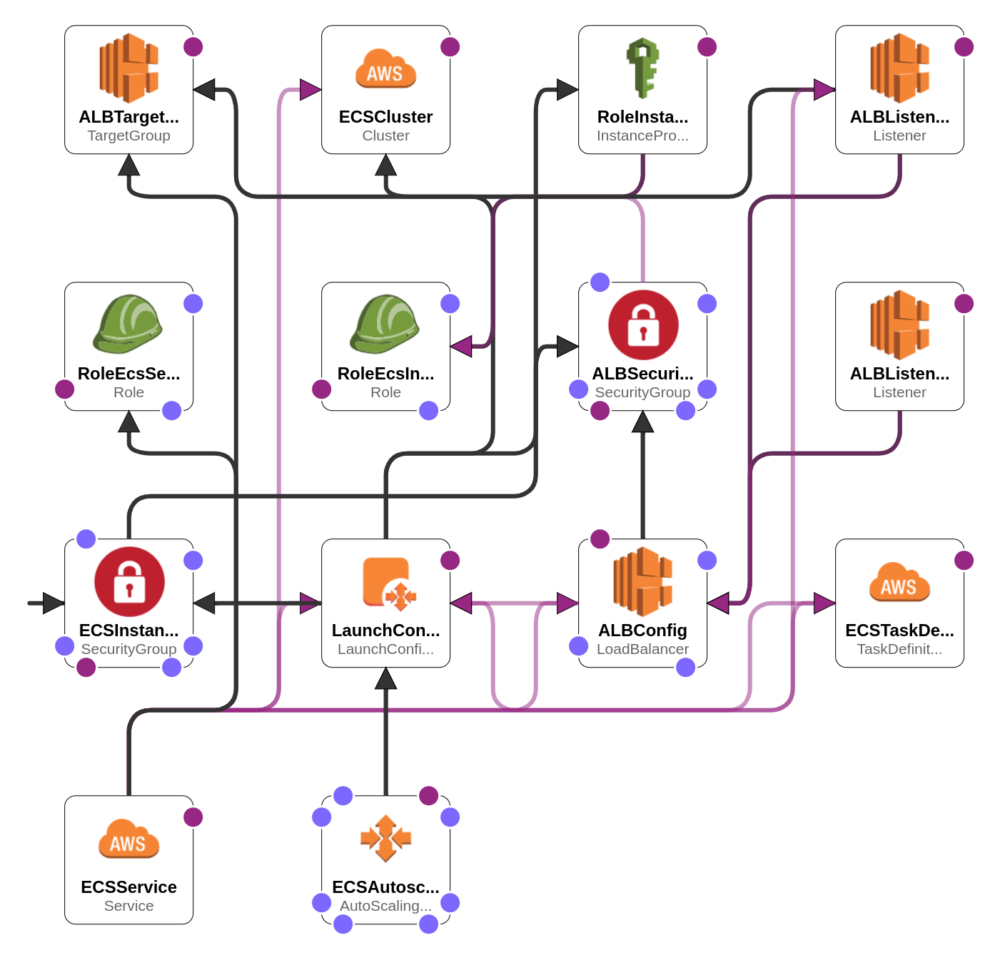

# Descrição

O arquivo contém um modelo AWS CloudFormation para criar um cluster ECS (Amazon Elastic Container Service) com vários recursos relacionados, como instâncias ECS, grupos de segurança, ALB (Application Load Balancer), target groups e tasks definitions.

# Parâmetros

O arquivo de modelo contém vários parâmetros que podem ser configurados para personalizar a implantação do cluster ECS. Aqui estão alguns dos principais parâmetros disponíveis:

`KeyName`: Chave SSH existente para permitir o acesso SSH às instâncias ECS.

`InstanceTypeParameter`: Tipo de instância EC2 a ser usado para as instâncias ECS.

`PublicIP`: Indica se um endereço IP público será atribuído às instâncias ECS.

`InstanceMonitoringDetailed`: Indica se o monitoramento detalhado das instâncias será ativado.

`ECSImageId`: ID da AMI da imagem otimizada para ECS (ECS Optimized).

`ECSClusterName`: Nome do cluster ECS.

`Environment`: Nome do ambiente (por exemplo, produção ou stage).

`NameService`: Nome do serviço ECS.

`CountDesired`: Quantidade de tarefas em execução no serviço.

`GraceCheckPeriods`: Período de tempo em segundos que o Amazon ECS ignora unhealthy.

`PortContainer`: Porta do grupo de destino (target group) para rotear o tráfego.

`ArnCertificate`: ARN do certificado HTTPS (ACM).

`ALBScheme`: Modo de funcionamento do Application Load Balancer (ALB), interno (**internal**) ou voltado para a internet (**internet-facing**).

`SSLPolicy`: Políticas de segurança que definem as cifras e protocolos que o listener do ALB suporta.

`PortHost`: Mapeamento da porta do contêiner para uma porta do host.

`ApplicationName`: Nome da aplicação.

`MemoryHard`: Limite máximo de memória a ser atribuído ao contêiner.

`MemorySoft`: Limite suave de memória a ser reservado para o contêiner.

`ImageAddress`: Imagem a ser usada para o contêiner.

`ASSubnet1`, `ASSubnet2`, `ASSubnet3`: IDs das sub-redes onde as instâncias ECS serão implantadas.

`ASDesiredCapacity`: Número desejado de instâncias.

`ASMaxSize`: Número máximo de instâncias.

`ASMinSize`: Número mínimo de instâncias.

`TaskDefVersion`: Número da revisão da definição da tarefa.

`ECSTaskContainerName`: Nome da definição da tarefa.

`EbsVolumeSize`: Tamanho do volume EBS (mínimo de 30GB).

`EbsVolumeType`: Tipo de volume EBS.

`VPCID`: ID da VPC onde o cluster ECS será implantado.

`TGProtocol`: Protocolo a ser usado para rotear o tráfego para os grupos de destino.

# Uso

O template deve ser importado no AWS CloudFormation.

